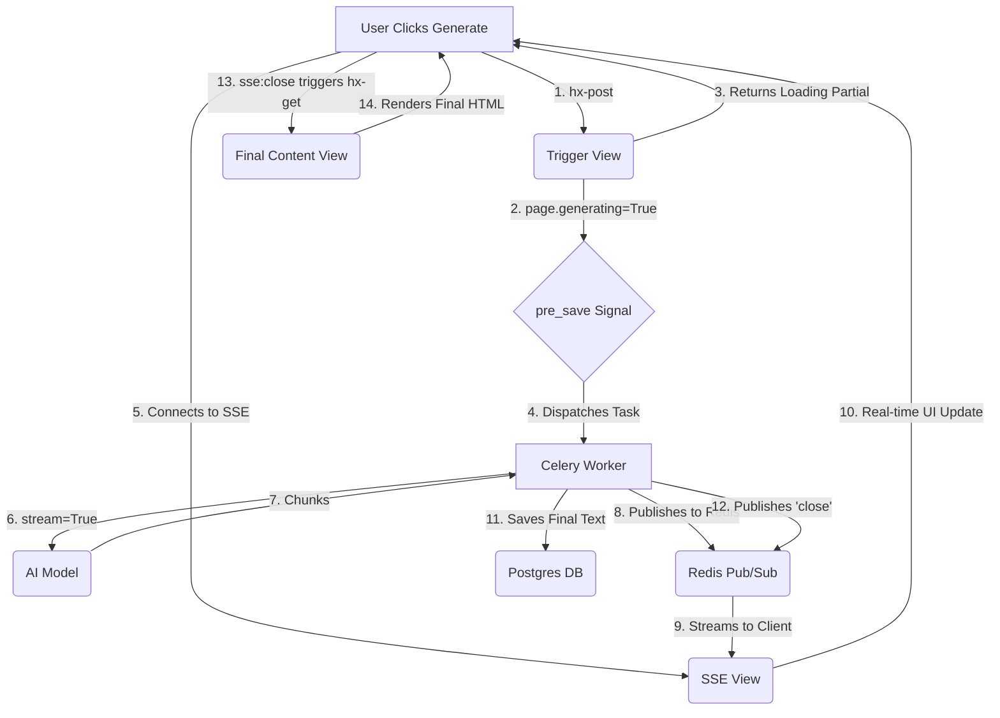

# AI Workflow Design: "Signal, Stream, Swap"

This document outlines a scalable design pattern for integrating asynchronous AI workflows into the Story Sprout application. The pattern, named "Signal, Stream, Swap," is designed to provide real-time UI updates for long-running AI tasks while maintaining a decoupled and robust backend architecture.

**Core Technologies:**
- **Backend:** Django, Celery
- **Frontend:** HTMX, Server-Sent Events (SSE)
- **Communication:** Redis (for Celery broker and Pub/Sub)

---

## The Pattern: Signal, Stream, Swap

The workflow is divided into three distinct phases:

### 1. Signal (Client → Server → Celery)

This phase initiates the AI task without blocking the user.

**Flow:**
1.  **UI Trigger:** The user clicks a button in the AI Panel (e.g., "Generate Content"). This button makes an HTMX POST request to a dedicated trigger view.
    ```html
    <!-- Example: templates/cotton/ai/panel/content/index.html -->
    <button hx-post=""
            hx-target="#page-content-wrapper-{{ page.uuid }}"
            hx-swap="outerHTML">
        Generate Content
    </button>
    ```

2.  **Trigger View:** A Django view receives the request. Its sole responsibilities are:
    -   Set the corresponding `_generating` flag on the target model to `True` (e.g., `page.content_generating = True`).
    -   Save the model instance.
    -   Return an HTMX partial that shows a "loading" state and establishes a connection to the SSE stream.

    ```python
    # ai/views.py
    @require_http_methods(["POST"])
    def trigger_page_content_generation(request, page_uuid):
        page = get_object_or_404(Page, uuid=page_uuid)
        page.content_generating = True
        page.save() # This triggers the signal

        # Return a partial that connects to the SSE stream
        return render(request, "stories/partials/page_content_streaming.html", {"page": page})
    ```

3.  **`pre_save` Signal:** The existing signal in `ai/signals.py` detects the change in the `content_generating` flag and dispatches the Celery task via the `orchestrate` service. **No changes are needed here.**

4.  **Streaming Partial:** The template returned by the trigger view contains the SSE connection logic.
    ```html
    <!-- stories/partials/page_content_streaming.html -->
    <div id="page-content-wrapper-{{ page.uuid }}" hx-ext="sse" sse-connect="" sse-swap="message">
        <div id="page-content-{{ page.uuid }}" class="prose animate-pulse">Generating...</div>
        <div hx-get="" hx-trigger="sse:close" hx-target="#page-content-wrapper-{{ page.uuid }}" hx-swap="outerHTML"></div>
    </div>
    ```

### 2. Stream (Celery → Redis → Server → Client)

This phase handles the real-time delivery of AI-generated content.

**Flow:**
1.  **Streaming Celery Task:** The Celery task in `ai/tasks.py` is modified to use the `stream=True` option with the AI provider (`litellm`).

    ```python
    # ai/tasks.py
    from django.core.cache import cache # Using Redis cache as Pub/Sub

    @shared_task
    def page_content_workflow(workflow_id):
        # ... (setup job, get page) ...
        job.mark_as_running()

        response = litellm.completion(model="...", messages=[...], stream=True)

        full_text = ""
        channel_name = f"ai_job_{job.uuid}"

        for chunk in response:
            text_chunk = chunk.choices[0].delta.content or ""
            if text_chunk:
                full_text += text_chunk
                # Publish chunk to Redis
                cache.set(channel_name, f"event: message\ndata: {text_chunk}\n\n", timeout=10)

        # ... (save full_text to page.content, mark job as succeeded)

        # Signal completion
        cache.set(channel_name, "event: close\ndata: Job finished\n\n", timeout=10)
    ```

2.  **SSE View:** A new, simple view is created to handle the SSE connection. It listens to the Redis channel and streams data to the client.

    ```python
    # ai/views.py
    from django.http import StreamingHttpResponse
    from django.core.cache import cache
    import time

    def stream_updates(request, job_uuid):
        def event_stream():
            channel_name = f"ai_job_{job_uuid}"
            last_message = None
            while True:
                message = cache.get(channel_name)
                if message and message != last_message:
                    yield message
                    last_message = message
                    if "event: close" in message:
                        break
                time.sleep(0.1) # Avoid busy-waiting

        return StreamingHttpResponse(event_stream(), content_type="text/event-stream")
    ```

### 3. Swap (Client → Server)

This final phase cleans up the UI and replaces the streaming content with the final, persistent version.

**Flow:**
1.  **"close" Event:** The Celery task sends a final `close` event over the SSE connection after the AI stream is complete and the `Page` model has been updated.

2.  **Final HTMX Swap:** The `div` in the streaming partial (`page_content_streaming.html`) listens for this `sse:close` event and triggers a final `hx-get` request.

    ```html
    <div hx-get="" hx-trigger="sse:close" hx-target="#page-content-wrapper-{{ page.uuid }}" hx-swap="outerHTML"></div>
    ```

3.  **Final Partial View:** This `GET` request fetches a simple partial containing the final, saved content from the `Page` model, effectively replacing the streaming component and unlocking the UI.

---

## Diagram



This pattern provides a robust, scalable, and user-friendly solution for integrating generative AI features into the application.
