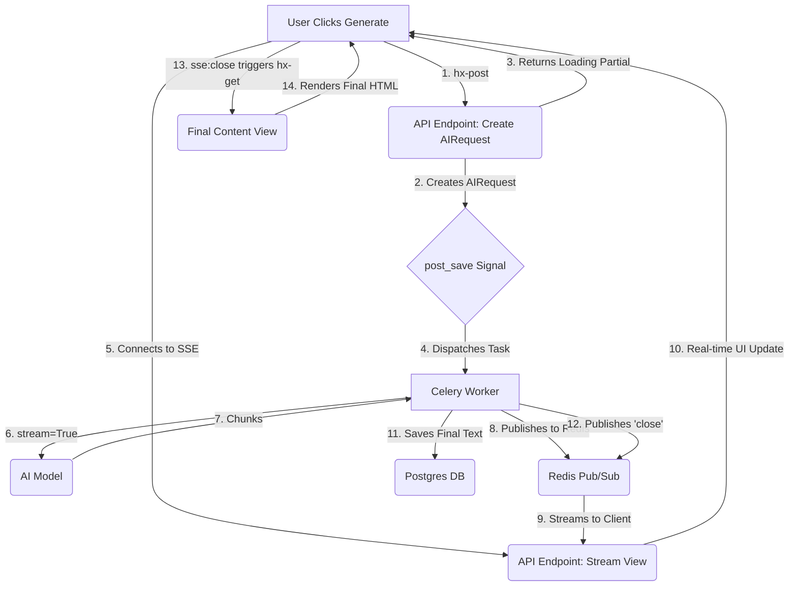

# AI Workflow Design: "Signal, Stream, Swap"

This document outlines a scalable design pattern for integrating asynchronous AI workflows into the Story Sprout application. The pattern, named "Signal, Stream, Swap," is designed to provide real-time UI updates for long-running AI tasks while maintaining a decoupled and robust backend architecture.

**Core Technologies:**
- **Backend:** Django, Celery, Django Ninja
- **Frontend:** HTMX, Server-Sent Events (SSE)
- **Communication:** Redis (for Celery broker and Pub/Sub)

---

## The Pattern: Signal, Stream, Swap

The workflow is divided into three distinct phases:

### 1. Signal (Client → Server → Celery)

This phase uses an explicit `AIRequest` model to initiate the AI task without blocking the user.

**Flow:**
1.  **UI Trigger:** The user clicks a button which makes an HTMX POST request to a new API endpoint.
    ```html
    <!-- Example: Button to generate page content -->
    <button hx-post=""
            hx-vals='{"target_uuid": "{{ page.uuid }}", "workflow_name": "page_content"}'
            hx-target="#page-content-wrapper-{{ page.uuid }}"
            hx-swap="outerHTML">
        Generate Content
    </button>
    ```

2.  **API Endpoint (`api.py`):** A Django Ninja view receives the request. Its responsibilities are:
    -   Create an `AIRequest` instance, linking it to the target object (e.g., a `Page`) and the user.
    -   Return an HTMX partial that shows a "loading" state and establishes a connection to the SSE stream.

    ```python
    # apps/ai/api.py
    @router.post("/requests")
    def create_request(request, payload: AIRequestIn):
        target = get_object_or_404(Page, uuid=payload.target_uuid)
        ai_request = AIRequest.create_for_target(
            user=request.user,
            target=target,
            workflow_name=payload.workflow_name
        ) # This save triggers the signal

        # Return a partial that connects to the SSE stream
        return render(request, "ai/partials/streaming.html", {"request": ai_request})
    ```

3.  **`post_save` Signal:** A signal in `ai/signals.py` detects the creation of a new `AIRequest` and dispatches the appropriate Celery task.

4.  **Streaming Partial:** The template returned by the API contains the SSE connection logic.
    ```html
    <!-- ai/partials/streaming.html -->
    <div id="page-content-wrapper-{{ request.target.uuid }}" 
         hx-ext="sse" 
         sse-connect="" 
         sse-swap="message">
        
        <div id="page-content-{{ request.target.uuid }}" class="prose animate-pulse">Generating...</div>
        
        <!-- This div listens for the 'close' event to fetch the final content -->
        <div hx-get="" 
             hx-trigger="sse:close"
             hx-target="#page-content-wrapper-{{ request.target.uuid }}"
             hx-swap="outerHTML"></div>
    </div>
    ```

### 2. Stream (Celery → Redis → Server → Client)

This phase handles the real-time delivery of AI-generated content.

**Flow:**
1.  **Streaming Celery Task:** The Celery task in `ai/tasks.py` is modified to use `stream=True`.

    ```python
    # ai/tasks.py
    from django.core.cache import cache # Using Redis cache as Pub/Sub

    @shared_task
    def page_content_workflow(request_id):
        ai_request = AIRequest.objects.get(id=request_id)
        ai_request.mark_as_running()

        response = litellm.completion(..., stream=True)

        full_text = ""
        channel_name = f"ai_request_{ai_request.uuid}"

        for chunk in response:
            text_chunk = chunk.choices[0].delta.content or ""
            if text_chunk:
                full_text += text_chunk
                # Publish chunk to Redis
                cache.set(channel_name, f"event: message\ndata: {text_chunk}\n\n", timeout=10)

        # ... (save full_text to page.content, mark request as success)

        # Signal completion
        cache.set(channel_name, "event: close\ndata: Job finished\n\n", timeout=10)
    ```

2.  **SSE View (`api.py`):** The API provides an endpoint to handle the SSE connection.

    ```python
    # apps/ai/api.py
    from django.http import StreamingHttpResponse
    from django.core.cache import cache
    import time

    @router.get("/requests/{request_uuid}/stream")
    def stream_updates(request, request_uuid: UUID):
        def event_stream():
            channel_name = f"ai_request_{request_uuid}"
            # ... (streaming logic remains the same) ...

        return StreamingHttpResponse(event_stream(), content_type="text/event-stream")
    ```

### 3. Swap (Client → Server)

This final phase cleans up the UI and replaces the streaming content with the final, persistent version. The logic remains identical to the original design.

---

## Diagram



This pattern provides a robust, scalable, and user-friendly solution for integrating generative AI features into the application.
