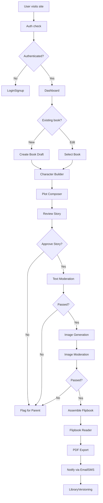

# StorySprout App Flow Document

## Onboarding and Sign-In/Sign-Up

When a new family arrives at StorySprout, they first see a welcoming landing page that briefly explains the magic of co-creating a custom storybook. From here, the parent can click a sign-up button or choose to log in if they already have an account. Signing up offers two straightforward methods: entering an email address and password or using a social login with Google or Apple. If the family chooses email, they receive a confirmation link that they must click before proceeding. If they choose social login, they grant StorySprout permission to access minimal profile information, and then they are taken directly into the app.

Once the account is confirmed, the parent is prompted to create their first family team by naming it and inviting any children or collaborators via email. Each invitee receives a link to join; clicking that link brings them to a sign-up or sign-in page where they authenticate and immediately land in the shared team space. If the parent ever forgets their password, the login page offers a password recovery link. Clicking that link sends a time-limited reset email, allowing them to enter a new password and regain access. Signing out is always available in the profile menu at the top right of the screen, where a single click ends the session and returns the user to the landing page.

## Main Dashboard or Home Page

After signing in or joining a team, the user arrives at the main dashboard, which is called the Library. The Library displays all existing books in chronological order, organized into tabs for drafts, completed stories, and a Trash folder. A persistent header shows the team name and a page-use meter indicating how many free or paid pages remain. A sidebar on the left offers navigation links to start a new book, access account settings, view billing details, and browse tutorials. At the top of the main content area is a prominent button to create a new story and a search field to find past books by title. The combination of header, sidebar navigation, and main content area ensures that families can move seamlessly to any part of the app.

## Detailed Feature Flows and Page Transitions

### Family and Team Setup Flow

When the parent clicks the button to start a new book, they are guided first through a quick check that the correct team is selected. If the family has multiple teams, a dropdown allows switching before creation. Once the team is confirmed, the app creates a draft book record in the background and redirects the user to the Character Builder.

### Character Builder Flow

In the Character Builder, the parent or child is greeted by a simple form that asks for the character’s name, personality traits in plain sentences, and a chosen visual style palette. The interface invites the user to upload a single source image if they want a custom look or skip the upload to use a system template. The image upload triggers automatic cropping and style conversion behind the scenes, producing a reference illustration that appears on screen. This reference is saved and displayed in a side panel to remind families how the character will look on every page. After adding traits and reviewing the preview, the user clicks a button to proceed to plot composition.

### Plot Composer Wizard Flow

The Plot Composer Wizard leads the family through five guided steps: world setup, conflict introduction, story climax, resolution, and moral takeaway. On each step, a text field invites manual input, and an AI autofill button offers suggestions. When the user hovers over a suggestion, they see sample text which they can accept or ignore. A live outline panel on the right updates as each section is filled in. The user can click any section to edit it at any time. Once they are happy with all five steps, they click “Next” to confirm the outline and move to the generation phase.

### AI Generation Pipeline Flow

Upon confirmation, the system triggers a background job that first calls the LLM to generate story text for each page. In the interface, a shimmer effect appears in each page’s text area as sentences stream in one by one. As soon as all text for a page is present, the interface renders it so the child can read or edit it immediately. Meanwhile, placeholders in the illustration slots display a loading animation while the image tasks run. The text generation and image generation tasks run in parallel, with the text always completing first. When each illustration finishes, it swaps into its slot automatically. A progress bar at the top counts completed pages out of the target page count. If the family is on the free plan and reaches three pages, a friendly paywall overlay describes how to unlock more pages. If they upgrade, the pipeline simply continues without losing state. The parent can pause the stream at any moment to review or override flagged content.

### Flipbook Reader Flow

When all pages are generated or the user manually ends the session, a button at the bottom of the generation view lets them switch to the Flipbook Reader. The reader displays pages in a mobile-first layout that animates at sixty frames per second. Users can tap, swipe, or use arrow keys to turn pages. Screen readers announce page numbers and read alt text for each illustration. A hidden menu icon reveals a “Read Aloud” button so the story text can be narrated automatically. The flipbook flow can return to the generation view via a back arrow, allowing edits or re-generation of individual pages.

### PDF Export Flow

From either the generation view or the flipbook reader, the family clicks an export icon to generate a print-ready PDF. WeasyPrint runs a background job that converts the story HTML into 300 dpi CMYK pages with half-inch margins and an auto-generated title page. Once complete, the app sends an email and optional SMS notification with a secure download link. If any page failed twice during generation, the PDF shows a placeholder image and a note that parent review is needed. The notification includes a link back to the draft for manual correction.

### Library and Versioning Flow

Returning to the Library, the family sees the newly completed book alongside older titles. Each book card shows its generation date and a status icon indicating whether it is published, in draft, or soft-deleted. Clicking a card opens the book in the flipbook reader. A menu on each card offers options to duplicate the story as a new draft, continue editing an unfinished draft, or send the book to Trash. When a book is soft-deleted, it moves to the Trash tab and remains visible for ninety days before being automatically purged.

### Billing and Upsell Flow

If the family exhausts their free pages or the paid quota, any attempt to generate another page triggers a modal explaining the current subscription tier and page usage. The modal offers an upgrade to the Premium plan with sixty pages per month or an add-on purchase for extra pages. Users enter payment details in a secure Stripe form embedded in the modal. Upon successful payment, the system updates the user’s page allowance and resumes any paused or blocked generation tasks.

## Settings and Account Management

The Settings area is accessible from the sidebar and opens in a full-page view with tabs for Profile, Notifications, Subscription, Moderation, and Team. Under Profile, users can update their name, email, and password. Notifications lets families toggle email alerts and optional SMS messages for job completions or failures. Subscription shows the current plan, usage meters, and buttons to upgrade or view billing history. The Moderation tab displays configurable thresholds in a simple form for violence, profanity, sexual content, and self-harm. Adjusting these values saves a JSON configuration unique to the team. The Team tab lists all members, their roles, and invites pending acceptance. From any settings page, a breadcrumb link returns the user to the Library.

## Error States and Alternate Paths

If a user enters invalid data—such as an empty character name or malformed email invite—the form highlights the field with an inline error message and a short explanation. During generation, if network connectivity drops, a banner appears at the top with a retry button that resumes the streaming pipeline once connectivity returns. If an image or text task fails twice, the system skips that page, flags it with a warning icon, and continues with the rest of the book. The parent sees a modal summary of skipped pages with links to retry or edit manually. If a user without proper permission tries to access billing or moderation settings, they receive an “Access Denied” message with guidance to contact the parent-admin.

## Conclusion and Overall App Journey

A family’s journey begins with a simple signup and team creation, then flows naturally through character definition, story outline, and real-time AI generation. Edits and parental reviews are always within reach, and a delightful flipbook reader brings the tale to life. When the story is ready, exporting a PDF and sharing keepsakes is just a click away. Throughout the process, friendly reminders guide families through free versus paid pages and offer upgrades without interrupting creativity. Error messages and fallback options ensure no one is left stuck, and thoughtful settings let parents control experience and safety. From the first page to the final flip, StorySprout delivers a seamless path to magical, personalized storybooks for families everywhere.

## Story Sprout Application Flow

This flowchart shows the complete user journey through the Story Sprout application, from initial visit to final PDF export.

