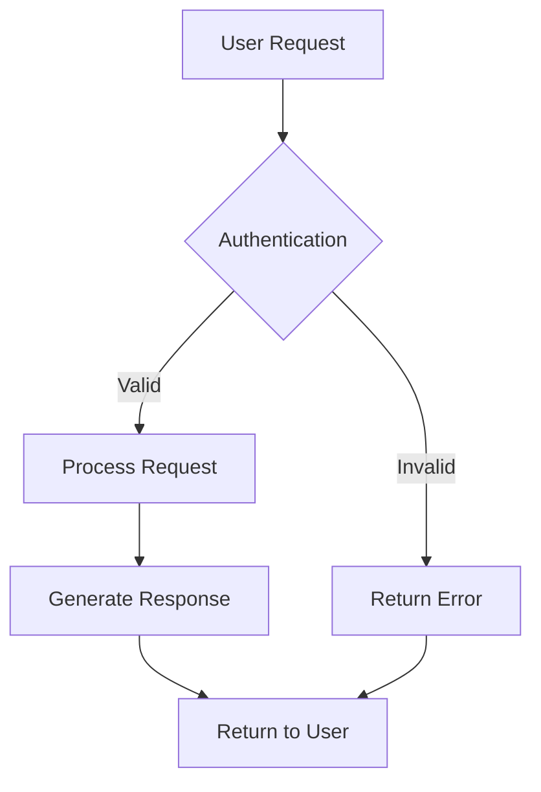
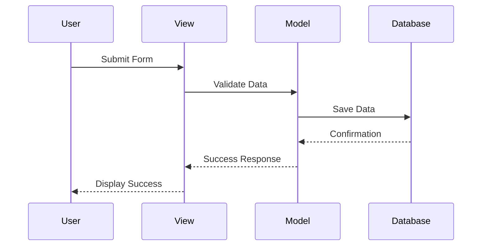

# Mermaid Diagram Test

This page tests Mermaid diagram functionality.

## Simple Flowchart



## Sequence Diagram



## Simple Class Diagram

```mermaid
classDiagram
    class Story {
        +String title
        +String content
        +User author
        +save()
        +delete()
    }
    
    class User {
        +String username
        +String email
        +create_story()
    }
    
    User ||--o{ Story : creates
```
